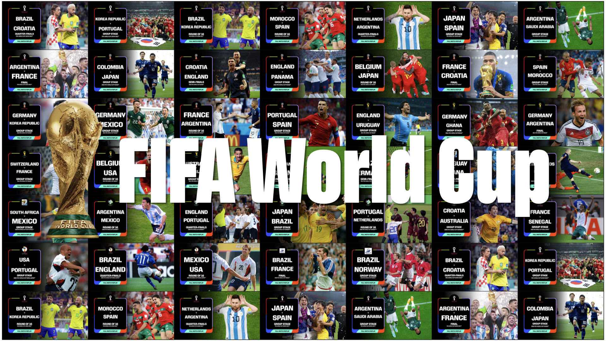

# FIFA World Cup Full-Match Video Dataset

<p align="center">
  
</p>

<p align="center">
  <a href="https://github.com/choucisan/fwc_games"></a>
  <a href="https://huggingface.co/datasets/choucsan/FIFA_World_Cup_Games"></a>
  <a href="https://choucisan.github.io/collections/fwc_games"></a>
  <a href="https://www.xiaohongshu.com/explore/6a28347e0000000016024961?xsec_token=ABKSEs1qbAzc4ocZhDx0e9CkuEQAXtCOPcoFbcRJaufac=&xsec_source=pc_user"></a>
  <a href="https://choosealicense.com/licenses/mit"></a>
</p>

This dataset provides YouTube full-match references and structured match annotations for classic FIFA World Cup games. Instead of redistributing video files, it stores YouTube video IDs and URLs, then links each retained match to structured football data including match metadata, team statistics, lineups, formations, text event timelines, and pre-match prediction polls.

The dataset is designed for long-form sports video research where models need to connect full football broadcasts with structured temporal and match-level evidence.

---

## Pipeline

The dataset is built through a multi-stage crawling and cleaning pipeline:

1. **Playlist extraction**: We started from the YouTube FIFA World Cup full-match playlist [`PLCGIzmTE4d0jq6wHT2TvSspZ_HLiIx4_y`](https://www.youtube.com/playlist?list=PLCGIzmTE4d0jq6wHT2TvSspZ_HLiIx4_y). From this playlist we extracted video IDs, URLs, titles, and team/year signals.
2. **Match normalization**: We parsed team names and World Cup editions from YouTube titles, normalizing aliases such as `Korea Republic` to `South Korea` and mapping editions such as `2022 Qatar`, `2018 Russia`, and `2002 Korea/Japan`.
3. **External match linking**: Each video record was linked to a Soccer365 match page when a confident match page could be identified.
4. **Structured data crawling**: For linked matches, we crawled match metadata, stadium information, attendance, referees, lineups, formations, team statistics, text event timelines, and prediction poll results.
5. **Folder-level packaging**: Structured data was stored in one folder per match with a stable human-readable folder name.
6. **Final validation**: We checked file coverage across all structured match directories. Each structured match includes `metadata.json`, `stats.json`, `events.json`, `lineups.json`, and `prediction.json`.

---

## Dataset Structure

```text
FIFA_World_Cup_Games/
+-- meta.jsonl                              # One YouTube/source-link record per indexed video
+-- README.md
+-- images/
|   +-- poster.jpeg                        # Dataset poster
+-- games/
|   +-- 2022-final-Argentina-vs-France/
|   |   +-- metadata.json                  # Video link and match venue metadata
|   |   +-- stats.json                     # Team-level match statistics
|   |   +-- events.json                    # Text timeline / key events
|   |   +-- lineups.json                   # Starting XI, substitutes, formations
|   |   +-- prediction.json                # Pre-match prediction poll
|   +-- 2018-group-stage-Germany-vs-Mexico/
|   |   +-- metadata.json
|   |   +-- stats.json
|   |   +-- events.json
|   |   +-- lineups.json
|   |   +-- prediction.json
|   +-- ...
+-- poster_assets/
    +-- thumbnails/                        # YouTube thumbnails used to build the poster
```

Each match folder is named as:

```text
YYYY-stage-TeamA-vs-TeamB
```

For example:

```text
2022-final-Argentina-vs-France
2014-semi-finals-Brazil-vs-Germany
2018-group-stage-Germany-vs-Mexico
```

The repository does not include downloaded video files. Use the `video_id` or `url` field in `meta.jsonl` to retrieve videos independently when your use case and local policies allow it.

---

## Dataset Overview

- **Indexed YouTube video records**: 40
- **Structured match folders**: 40
- **World Cup editions covered**: 7 editions, from 1998 France to 2022 Qatar
- **Unique national teams**: 25
- **Structured files per retained match**: `metadata.json`, `stats.json`, `events.json`, `lineups.json`, `prediction.json`
- **Total event timeline rows**: 3,543
- **Event rows per match**: 4 to 465, average 88.6
- **Stages covered**: group stage, 8th finals, quarter-finals, semi-finals, final
- **Statistics fields observed**: 22 team-level metric names
- **Video distribution**: Video files are not included; only YouTube IDs and URLs are provided

### Edition Coverage

| Edition | Indexed videos | Structured matches |
|---|---:|---:|
| 2022 Qatar | 8 | 8 |
| 2018 Russia | 10 | 10 |
| 2014 Brazil | 8 | 8 |
| 2010 South Africa | 3 | 3 |
| 2006 Germany | 5 | 5 |
| 2002 Korea/Japan | 4 | 4 |
| 1998 France | 2 | 2 |

Each indexed video has a corresponding structured match directory.

### Stage Coverage

| Stage | Structured matches |
|---|---:|
| Group stage | 20 |
| 8th finals | 8 |
| Quarter-finals | 5 |
| Semi-finals | 2 |
| Final | 5 |

---

## `meta.jsonl`

`meta.jsonl` is the top-level video/source index. Each line is a JSON object.

| Field | Type | Description |
|---|---:|---|
| `video_id` | string | YouTube video ID |
| `url` | string | YouTube watch URL |
| `title` | string | Original or lightly cleaned YouTube video title |
| `teams` | list[string] | Parsed teams in the match |
| `world_cup` | string | World Cup edition, such as `2022 Qatar` |
| `match_info_url` | string | Linked Soccer365 match page |

Example:

```json
{
  "video_id": "HxBqMbI5kqQ",
  "url": "https://www.youtube.com/watch?v=HxBqMbI5kqQ",
  "title": "FULL MATCH: Brazil v Croatia | Quarter-Finals | FIFA WORLD CUP QATAR 2022",
  "teams": ["Brazil", "Croatia"],
  "world_cup": "2022 Qatar",
  "match_info_url": "https://soccer365.net/games/15292867/"
}
```

---

## Match Metadata

Each `metadata.json` file links a source video to normalized match context.

| Field | Type | Description |
|---|---:|---|
| `source_video.id` | string | YouTube video ID |
| `source_video.url` | string | YouTube watch URL |
| `source_video.title` | string | Cleaned match title |
| `source_video.date` | string | Match date in `YYYY-MM-DD` format when available |
| `match_info.home_team` | string | Home/listed first team from the match source |
| `match_info.away_team` | string | Away/listed second team from the match source |
| `match_info.stage` | string | Tournament stage |
| `match_info.datetime` | string | Source datetime string |
| `match_info.stadium` | string | Stadium name |
| `match_info.location` | string | Stadium city and country |
| `match_info.temperature` | string | Source temperature string when available |
| `match_info.weather` | string | Weather text when available |
| `match_info.viewers` | string | Attendance |
| `match_info.referees` | list[string] | Referee crew when available |
| `soccer365_url` | string | Source match page |

Example:

```json
{
  "source_video": {
    "id": "ORzHdV_NVnQ",
    "url": "https://www.youtube.com/watch?v=ORzHdV_NVnQ",
    "title": "Argentina vs France -- 2022 FIFA World Cup Final",
    "date": "2022-12-18"
  },
  "match_info": {
    "home_team": "Argentina",
    "away_team": "France",
    "stage": "final",
    "datetime": "18.12.2022 23:59",
    "stadium": "Lusail",
    "location": "Lusail, Qatar",
    "temperature": "+35C",
    "weather": "",
    "viewers": "88,966",
    "referees": []
  },
  "soccer365_url": "https://soccer365.net/games/15292874/"
}
```

---

## Match Statistics

Each `stats.json` file stores team-level match statistics. The top-level keys are statistic names, and each value maps team names to values.

Common statistic keys include:

| Statistic | Description |
|---|---|
| `Expected Goals (xG)` | Expected goals when available, mainly for recent matches |
| `Shots` | Total shots |
| `Shots on Target` | Shots on target |
| `Shots Blocked` | Blocked shots |
| `Saves` | Goalkeeper saves |
| `Possession %` | Team possession percentage |
| `Corners` | Corner kicks |
| `Fouls` | Fouls committed |
| `Offsides` | Offside calls |
| `Yellow Cards` | Yellow cards |
| `Red cards` | Red cards |
| `Attacks` | Attacking sequences from the source page |
| `Dangerous Attacks` | Dangerous attacks from the source page |
| `Passes` | Total passes |
| `Pass Accuracy %` | Pass accuracy percentage |
| `Free Kicks` | Free kicks |
| `Throw-ins` | Throw-ins |
| `Crosses` | Crosses |
| `Tackles` | Tackles |

Example:

```json
{
  "Expected Goals (xG)": {
    "Argentina": "3.3",
    "France": "2.2"
  },
  "Shots": {
    "Argentina": "21",
    "France": "10"
  },
  "Shots on Target": {
    "Argentina": "9",
    "France": "5"
  }
}
```

The exact statistic set varies by match because older source pages expose fewer fields than recent matches.

---

## Events

Each `events.json` file stores a source-derived text timeline. Rows are ordered chronologically when the source exposes a detailed report. Older games may only include a compact list of major match events.

| Field | Type | Description |
|---|---:|---|
| `minute` | string | Match minute or source marker |
| `type` | string | Source event type code, such as `whistle`, `goal`, `subst`, `yc`, `rc`, or empty string |
| `description` | string | Human-readable event text |

Example:

```json
[
  {
    "minute": "-",
    "type": "whistle",
    "description": "The referee starts the match"
  },
  {
    "minute": "1",
    "type": "",
    "description": "Mexico kick-off, and the game is underway."
  },
  {
    "minute": "7",
    "type": "",
    "description": "Good effort by Mats Hummels as he directs a shot on target, but the keeper saves it"
  }
]
```

This field should be treated as a text event timeline rather than a fully standardized optical tracking or official event feed.

---

## Lineups

Each `lineups.json` file stores starting players, substitutes, and formations.

Team entries have the following structure:

| Field | Type | Description |
|---|---:|---|
| `<team>.starting` | list[object] | Starting XI players |
| `<team>.substitutes` | list[object] | Substitute bench players |
| `number` | string | Shirt number |
| `name` | string | Player name |
| `formation.<team>` | string | Formation, such as `4-3-3` |

Example:

```json
{
  "Argentina": {
    "starting": [
      {"number": "23", "name": "Emiliano Martinez"},
      {"number": "10", "name": "Lionel Messi"}
    ],
    "substitutes": [
      {"number": "22", "name": "Lautaro Martinez"}
    ]
  },
  "France": {
    "starting": [
      {"number": "1", "name": "Hugo Lloris"},
      {"number": "10", "name": "Kylian Mbappe"}
    ],
    "substitutes": [
      {"number": "26", "name": "Marcus Thuram"}
    ]
  },
  "formation": {
    "Argentina": "4-3-3",
    "France": "4-2-3-1"
  }
}
```

---

## Prediction Polls

Each `prediction.json` file stores the source page's pre-match user prediction poll.

| Field | Type | Description |
|---|---:|---|
| `<team> win.percentage` | string | Percentage of votes for a team win |
| `<team> win.votes` | string | Vote count for a team win |
| `draw.percentage` | string | Percentage of votes for a draw |
| `draw.votes` | string | Vote count for a draw |

Example:

```json
{
  "Argentina win": {
    "percentage": "36",
    "votes": "569"
  },
  "draw": {
    "percentage": "34",
    "votes": "525"
  },
  "France win": {
    "percentage": "30",
    "votes": "472"
  }
}
```

---

## Quick Start

### Install dependencies

```bash
pip install datasets huggingface_hub pandas yt-dlp
```

### Load `meta.jsonl` locally

```python
import json
from pathlib import Path

root = Path(".")

with open(root / "meta.jsonl", "r", encoding="utf-8") as f:
    videos = [json.loads(line) for line in f if line.strip()]

print(f"Loaded {len(videos)} video records")
print(videos[0])
```

### Read one structured match

```python
import json
from pathlib import Path

game_dir = Path("games/2022-final-Argentina-vs-France")

metadata = json.load(open(game_dir / "metadata.json", encoding="utf-8"))
stats = json.load(open(game_dir / "stats.json", encoding="utf-8"))
events = json.load(open(game_dir / "events.json", encoding="utf-8"))
lineups = json.load(open(game_dir / "lineups.json", encoding="utf-8"))
prediction = json.load(open(game_dir / "prediction.json", encoding="utf-8"))

print(metadata["source_video"]["url"])
print(stats["Shots"])
print(events[:3])
print(lineups["formation"])
print(prediction)
```

### Load from Hugging Face

```python
from datasets import load_dataset

# Replace repo_id with the final Hugging Face dataset repo name if different.
repo_id = "choucsan/FIFA_World_Cup_Games"

dataset = load_dataset(repo_id, data_files="meta.jsonl")
records = dataset["train"]

print(records[0])
```

### Download a YouTube video independently

Videos are not redistributed in this dataset. To download a video for local research use, use the `video_id` or `url` field with `yt-dlp`:

```bash
yt-dlp -f "bv*+ba/b" \
  -o "games/2022-final-Argentina-vs-France/video/%(id)s.%(ext)s" \
  "https://www.youtube.com/watch?v=ORzHdV_NVnQ"
```

Please ensure that downloading and using videos complies with YouTube's Terms of Service, copyright rules, and your local research policies.

---

## Applications

This dataset is intended for research on long-form sports video understanding and multimodal reasoning.

### Long Video Understanding

- Full-match reasoning over football broadcasts
- Long-context video-language modeling
- Temporal localization of goals, substitutions, fouls, cards, and momentum shifts
- Understanding knockout matches, extra time, and penalty shootouts from long videos

### Multimodal Question Answering

- Match-level QA combining video, team statistics, lineups, and event timelines
- Player and team questions grounded in starting XI and formation data
- Multi-hop questions linking event descriptions to final outcomes
- Venue, attendance, referee, and tournament-stage questions

### Visual Retrieval

- Query-by-text retrieval of match moments
- Retrieval of goals, saves, cards, substitutions, corners, and attacks from event text
- Cross-modal retrieval between YouTube video frames, textual timelines, and structured statistics

### Temporal Prediction

- Next-event prediction from match context and previous events
- Score and momentum progression modeling
- Pre-match expectation analysis using prediction polls and team metadata
- Comparing fan prediction distributions with actual match outcomes

### Sports Analytics

- Team-level statistical comparison across World Cup editions
- Formation and lineup analysis
- Match intensity analysis using attacks, dangerous attacks, fouls, cards, and shots
- Historical comparison of classic World Cup matches

---

## Download

Suggested Hugging Face dataset layout:

```text
choucsan/FIFA_World_Cup_Games
+-- meta.jsonl
+-- games/
|   +-- */metadata.json
|   +-- */stats.json
|   +-- */events.json
|   +-- */lineups.json
|   +-- */prediction.json
+-- images/
    +-- poster.jpeg
```

Example commands:

```bash
# Download metadata only
huggingface-cli download choucsan/FIFA_World_Cup_Games \
  meta.jsonl \
  --repo-type dataset \
  --local-dir FIFA_World_Cup_Full_Match_Dataset

# Download all structured annotations
huggingface-cli download choucsan/FIFA_World_Cup_Games \
  --repo-type dataset \
  --local-dir FIFA_World_Cup_Full_Match_Dataset
```

Video files are not included. Use the `url` field in `meta.jsonl` or `metadata.json` to download videos independently when permitted.

---

## Data Quality Notes

- The dataset links public YouTube full-match videos to Soccer365-derived structured match pages.
- `events.json` is a text timeline from the source page. It is not a frame-accurate official tracking feed.
- Event coverage varies by match. Recent matches may include dense commentary, while older matches may only expose key events.
- `stats.json` fields vary by match because the source exposes richer statistics for recent editions.
- `meta.jsonl` contains 40 indexed video records and `games/` contains 40 structured match folders.
- Each structured match folder has been checked against `meta.jsonl` by YouTube video ID, Soccer365 URL, and participating teams.
- Team order follows the source pages and should not always be interpreted as FIFA's official home/away designation.

---

## Contact

For questions, corrections, or collaboration requests:

[choucisan@gmail.com](mailto:choucisan@gmail.com)
